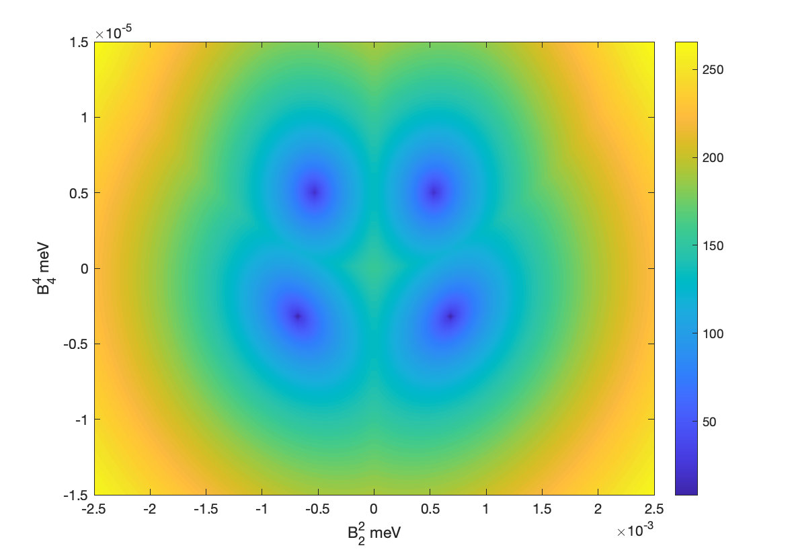

# Summary

Inelastic neutron scattering (INS) is a spectroscopic technique used to measure the magnetic excitations in materials with interacting electron spins. Fitting the experimental data to a spin Hamiltonian model can be formulated as an inverse eigenvalue problem (IEP). `INS_IEP` is a MATLAB package that uses deflated numerical optimisation techniques to find multiple solutions to this problem. The package requires and is fully compatible with `easyspin` [@stoll_easyspin_2006], a package for solving similar problems in electron paramagnetic resonance.

# Statement of need


Neutrons are an excellent bulk probe of material properties since they carry no charge and therefore penetrate deeply into matter. Neutrons also carry a quantum spin of a half, making them a sensitive probe of magnetism[@Squires_2012]. Reactors and spallation sources with dedicated high-flux neutron sources serve the international research community with neutron scattering experiment capabilities for material research. One technique at neutron facilities is the measurement of inelastic neutron scattering (INS) to study magnetism. In an INS experiment, a sample under investigation is irradiated with a beam of neutrons and the scattered neutron energy and momentum transfer are detected. For samples composed of finite-size clusters of magnetic moment-carrying atoms, such as single ions or molecular-based magnets, the detected neutron energy transfer gives direct access to the quantum spin excitations [@furrer_magnetic_2013;@baker_neutron_2012;@baker_spectroscopy_2014]. The energy of such excitations relates to the energy difference between eigenvalues of the Hamiltonian matrix that describes the quantum spin dynamics of the compound in question. Single-ion and molecular-based magnets are studied as prototype components (quantum bits, sensors) for quantum technologies. INS can therefore provide crucial information concerning the precise quantum properties of such systems. However, to relate the INS experimental results to the Hamiltonian that describes quantum spin dynamics requires parameterisation of matrix elements such that a set of eigenvalues and eigenstates matching the experiment are determined. This situation is known as the inverse eigenvalue problem. To date, this problem is addressed in an iterative process where parameters of the Hamiltonian are varied and the resultant eigenvalues compared with experiment. INS_IEP presents an elegant solution to solving this problem, alleviating the necessity of iterative Hamiltonian matrix diagonalisation, providing a more robust method to reliably extract an accurate spin Hamiltonian model from INS experimental data. 


# The Spin Hamiltonian

The Spin Hamiltonian, $H$, is an approximation of the Hamiltonian that uses spin coordinates instead of orbital coordinates, it is  widely used to model data arising from many spectroscopy techniques [@launay_electrons_2014]. It can be modeled as a linear combination of interaction terms, we will focus on the zero field interaction, $H_{ZFI}$, and the elctron-electron interaction, $H_{EEI}$:

$$H = H_{ZFI} + H_{EEI} $$

Both of these terms can themselves be modelled as the linear sum of other basis matrices. The zero field interaction can be written as:

$$H_{ZFI} = \sum_{-k\leq q \leq k} B^q_kO^q_k$$

where the $O^q_k$ are Stevens Operators [@rudowicz_generalization_2004], and $B^q_k$ the assosiated parameter. When there are multiple spin centres it is necessary to take kronecker products of the operator with identity matrices of the appropriate for each other spin centre.

When there are multiple spin centres it is also necessary to include an electron-electron interaction term, H_{EEI}. This term will be the sum of interaction terms between each pair of spin centres:

$$H_{EEI} = -\sum_{i\neq j} J_{ij}  S_i\cdot  S_j$$

where $S_i$ is the vector of spin operators $S_i = [S_x, S_y, S_z]$ for the $i$-th spin centre, and $J_{ij}$ is the unknown parameter. Note that in the isotropic case $J$ can be thought of as a scalar value, but in the anisotripc case will be a matrix where the off diagonals are skew symmetric. While the summation is in theory over all spin centre comninations, in practice many of these contributions will be negligible - often only the nearest neighbour interactions are modeled. 


# Mathematical Background 
## Inverse Eigenvalue Problem


The INS experiements provide eigenvalues of the Spin Hamiltonian matrix of the sample, the task of calculating the matrix from the eigenvalues is an inverse eigenvalue problem:

Let $A(x)$ be the affine family of matrices,

$$A( x) = A_0 + \sum^\ell_{i=1} x_i A_i,$$

where $x\in\mathbb R^\ell$ and $A_0,\dots,A_\ell \in \mathbb R^{n\times n}$ are linearly independent symmetric matrices, and denote the ordered eigenvalues of $A(x)$ as $\lambda_1(x)\leq\dots\leq\lambda_n(x)$.
Then the least squares inverse eigenvalue problem is to find the parameters $x \in \mathbb R^\ell$ that minimises

$$F(x) = \frac 1 2 ||r(x)||^2_2 = \frac 1 2 \sum^m_{i=1}(\lambda_i(x) - \lambda_i^*)^2$$

where $\lambda^*_1\leq\ldots\leq\lambda_m^*$ are the experimental eigenvalues. In the case of INS fitting the $A_i$ basis matrices will be a combination of Stevens operators and electron-electron exchange terms. The IEP described above is formulated as an least squares problem, this is due to the fact that the number of eigenvalues that can be probed by INS experiments is often a small subset of the full spectrum

As far as we are aware this is the first time that the fitting of INS data has been explicitly formulated as an IEP. The advantage of this formulation is that there are explicit formulas for the derivatives of $r(x)$, the first derivative (Jacobian) is:

$$ J_r(x) = \begin{pmatrix}
        q_1(x)^TA_1q_1(x)&\dots &q_1(x)^TA_\ell q_1(x)\\
        \vdots&\ddots&\vdots\\
        q_m(x)^TA_1q_m(x)&\dots& q_m(x)^TA_\ell q_m(x)
    \end{pmatrix}.$$    

And the second derivative (Hessian) is:

$$ (H_{r})_{ij}   = 2\sum^m_{k=1} (\lambda_k-\lambda_k^*) \sum^m_{\substack            {t=1\\\lambda_t\neq\lambda_k}} \frac{(q_t^TA_iq_k)(q_t^TA_jq_k)}{\lambda_k-\lambda_t}.
$$

Access to analytical forms of the derivatives means it is not necessary to use the finite difference approximation that other approaches use, making the three optimisation  methods that ``INS_IEP`` uses faster and more accurate. 

## Methods

All of the methods used are iterative schemes of the form $x^{k+1} = x^k +p^k$ where the step $p^k$ uniquely defines each algorithm:

-  Newton's method: $p^k = (J_r^TJ_r + H_rr){-1}J_r^Tr$ [@nocedal_numerical_2006]
-  Gauss-Newton method: $p^k = (J_r^TJ_r)^{-1}J_r^Tr$ [@bloor_deflation_2025]
-  Lift and Projection Method: $p^k = B^{-1}J_r^Tr$ [@bloor_riemannian_2025]

Where the matrix $B$ is the Gram matrix formed from the frobenius inner products of the basis matrices: $B_{ij} = \langle A_i, A_j\rangle_F$. The Lift and Projection method is a a Riemannian Gradient descent method [@bloor_riemannian_2025], inspired by the Lift and Projection method [@chen_least_1996], specifically designed for solving IEPs. In [@bloor_riemannian_2025] it is proven that the method is a strictly descending algorthim, that is it reduces the value of the objective function every step. Both the deflated Gauss-Newton method and the Riemannian Gradient descent Lift and Projection method are new methods designed for this package. 

## Deflation 

The number of eigenvalues that can be probed via INS experiments varies  depending on the equipment and sample in question, meaning that the fitting problem is often under (or even over) determined. The IEP is also highly nonlinear and due to the experimental nature of the data there is no guarentee that the problem is not ill-posed. One consequence of this is that the solution space my be very 'bumpy', that is there may exist many local minimisers to the problem. For example in figure \autoref{fig:mn12}, there are clearly 4 distinct solutions (for more details see Example1_Mn12 in the examples folder). We seek to solve the problem of multiple local minima by the use of Deflation, a numerical technique used to find multiple solutions to systems of equations [@farrell_deflation_2015;@farrell_deflation_2020]. Fortunately it is cheap to apply deflation for the above methods, it is simply a change to the length of the step - notably this means that the direction of each step does not change [@bloor_deflation_2025]. 

<!--![Left: Contour plot of how $F$ varies with the two parameters $B^2_2$ and $B_4^4$ for the molecule Mn\_12 as described in [@bircher_transverse_2004]. Right: Convergence plot for finding each minimum using deflation 
\label{fig:mn12}](Mn12_figure.png) 
-->

{ width=1000 }


## Examples
## Example 1 - Mn12 
The first example we will look at is Manganese-12-acetate. This is a well know example in the INS and magnetism community, as one of the first molecules that  behaves like a nano-sized magnet with a molecular magnetic coercivity as well as its role in the research of quantum tunnelling of magnetisation [@friedman_macroscopic_1996;@sessoli_magnetic_1993]. 

The Spin Hamiltonian of this system, using the giant spin approximation, can be represented as a $21\times21$ matrix modelled using 4 Stevens operators [@bircher_transverse_2004]:

$$H = B^0_2O^0_2 + B^0_4O^0_4 +B^2_2O^2_2 +B^4_4O^4_4 \in \mathbb R^{21\times 21} $$

We utilise the same spin system syntax as `easyspin`, so to set up the problem we first set up the model, along with initial guesses for the parameters:
```matlab
  %One spin centre (because giant spin approximation)
  Sys0.S=10; 
  %Four Stevens operators 
  Sys0.B2 = [-100,0,-1000,0,0];   
  Sys0.B4 = [-1,0,0,0,-1,0,0,0,0];
```
Then we input the experimental eigenvalues, these will normally be translated such that the smallest eigenvalue is zero, and define which parameters to fit. Note that all values given must be in Hertz, so it may be useful to use conversions.
```matlab
  rcm = 29979.2458;   meV = rcm*8.065;  %Conversions values
  %Input calculated eigenvalues:
  Exp.ev = [0,0,1.24,1.24,2.3,2.3,3.18,3.18,3.91,3.91,4.5,4.5,4.97,4.97,5.32,5.32,5.54,5.59,5.69,5.75,5.78].*meV;
  %Vary all non zero parameters (no Fixed parameters):
  Vary = Sys0; 
```
Then all that is required is to call `INS_IEP` with these three inputs:
```matlab
  SysOut = INS_IEP(Sys0,Vary,Exp);
```
If we wish to find all four solutions as shown in figire \autoref{fig:contour} then we use the aditional option:

```matlab
  Opt.NDeflations = 4;
  SysOut = INS_IEP(Sys0,Vary,Exp,Opt);
```
In this case SysOut will be an array of four spin structures each containing a distinct solution. 

## Example 2 - Chromium(iii) Horseshoes
The second example concerns antiferro-magnetically coupled
chromium(III) chains six atoms long [@baker_varying_2011], although different length chains are of interest and can also be modelled. Because there are multiple spin centres an electron-electron interaction term is required. The spin hamiltonian is a 4096×4096 matrix composed of two Stevens operators and one interaction term:

```matlab
  Sys0.S = [1.5 1.5 1.5 1.5 1.5 1.5];
  Sys0.B2 =  [1     0    -1     0     0;
             1     0    -1     0     0;
             1     0    -1     0     0;
             1     0    -1     0     0;
             1     0    -1     0     0;
             1     0    -1     0     0];
  Sys0.J = [100,0,0,0,0,100,0,0,0,100,0,0,100,0,100];
  Vary = Sys0;
  Exp.ev = [0,0.355,0.457,0.497,1.576,1.577,1.592,1.629,1.632,2.97,2.98,3.002,3.004,
            3.01,3.038,3.821,3.824,3.827,3.837,3.856,3.879,3.888,3.895,3.903];
```
Note that only 24 eigenvalues were found experimentally, so this will form a partial eigenvalue problem. To find the solution system is as simple as:
```matlab
  SysOut = INS_IEP(Sys0,Vary,Exp);
```
It is possible to find multiple minimising systems even if they do not make any sense physically, however due to the scalling of the problem a change in the default deflation parameters is necessary:
```matlab
  Opt = struct('NDeflations',4,'Sigma',1e-7);
  SysOut= INS_IEP(Sys0,Vary,Exp,Opt);
```
The output contains four different spin systems that all have the same eigenvalues as input, one is the original solution up to a change of sign of the $B_2^2$ parameter, and all have the same exchange term. 

# Acknowledgements

ABR thanks the University of Manchester for a Dean’s Doctoral Scholarship. MW thanks the Polish National Science Centre (SONATA-BIS-9), project no. 2019/34/E/ST1/00390, for the funding that supported some of this research. 

# References

@Squires_2012 - https://doi.org/10.1017/CBO9781139107808
